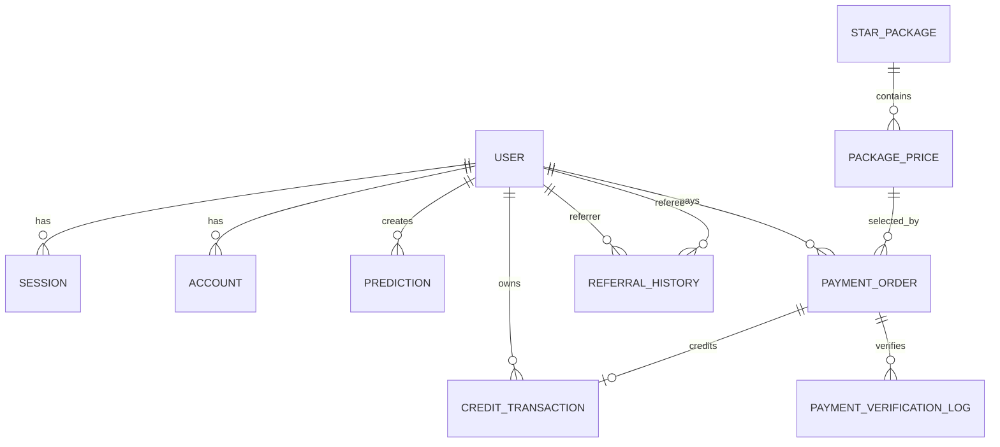

# MMV Tarots

AI Tarot platform with LINE LIFF login, async multi-agent readings, star-based credits, and PromptPay billing designed for real-world Thai mobile usage.

**Production**: `https://maemormimi.com`

## Product Snapshot

MMV Tarots combines four main systems in one product:

- LINE-first authentication through LIFF and Better Auth
- AI tarot prediction workflow with gatekeeper, analyst, and mystic agents
- `stars` wallet for question credits, onboarding rewards, and referrals
- PromptPay payment flow with billing history and support escalation

The current payment model uses `single draft reuse`: one purchase journey should map to one active draft order, even if the user reopens the payment flow after expiration.

## Core Experience

| Surface | Purpose |
| --- | --- |
| `app/page.tsx` | Ask a tarot question and start a reading |
| `app/liff/page.tsx` | LINE LIFF gateway for mobile entry |
| `app/submitted/page.tsx` | Track an in-flight prediction |
| `app/history` | Review completed readings |
| `app/package/page.tsx` | Buy star packages and restore recent payment flow |
| `app/billing/page.tsx` | View meaningful billing states and request support |
| `app/transactions/page.tsx` | Inspect star ledger activity |
| `app/share/[id]` | Share prediction results |

## Architecture at a Glance

```text
LINE / Browser
   -> Better Auth + LIFF verification
   -> Session shell + wallet hydration
   -> Ask question / buy stars
   -> AI workflow or PromptPay lifecycle
   -> Persist history, billing, and support context
```

### Main Domains

| Domain | Key Files |
| --- | --- |
| Auth / LIFF | `lib/server/auth.ts`, `app/api/auth/liff-verify/route.ts`, `lib/server/services/line-identity-service.ts` |
| Prediction Workflow | `services/tarot-service.ts`, `app/api/predict/route.ts`, `services/prediction-service.ts` |
| Credits / Wallet | `services/credit-service.ts`, `app/api/credits/*` |
| Payment / Billing | `lib/server/services/payment-order-service.ts`, `lib/server/services/payment-fulfillment-service.ts`, `app/api/payment/orders/*` |
| Referral | `lib/server/services/referral-service.ts`, `app/api/user/referral-claim/route.ts`, `middleware.ts` |
| UI Shell | `lib/client/providers/navigation-provider.tsx`, `components/features/*`, `components/layout/*` |

## What Is Special Here

### 1. LINE-first auth without mixing provider logic into UI
- Better Auth remains the auth core.
- LINE verification and identity linking live in dedicated server services.
- The client restores target routes through the session shell contract.

### 2. Async tarot pipeline instead of blocking request/response
- A prediction request creates a job.
- Gatekeeper and analyst run before mystic finalizes the reading.
- The submitted page polls for completion while the workflow continues in the background.

### 3. Stars as a real ledger, not just a counter
- Questions spend stars.
- Top-ups credit stars through payment fulfillment.
- Referral and onboarding flows issue credits through explicit ledger entries.

### 4. Payment semantics designed for user clarity
- Active orders can be reused.
- Expired no-slip drafts can be revived.
- Orders with slip evidence are never revived back into draft state.
- Billing UI hides raw noise drafts by default.

## Database Overview

Main Prisma domains:

- `User`, `Session`, `Account`, `Verification`
- `Prediction`, `Card`
- `CreditTransaction`
- `StarPackage`, `PackagePrice`
- `PaymentOrder`, `PaymentVerificationLog`
- `ReferralHistory`
- `AgentConfig`, `SuggestedQuestion`

Mermaid snapshot:



## Getting Started

### Prerequisites

- Node.js 22.18.0 (see `.nvmrc`; content-creator uses native SQLite modules)
- npm 10+
- PostgreSQL database
- LINE developer credentials
- Gemini model access
- SlipOK credentials for QR slip verification

### Install

```bash
cd /Users/non/dev/opilot/projects/mmv-tarots
npm install
```

### Configure Environment

This project does not currently ship with a canonical `.env.example`, so create `.env.local` manually.

Minimum variables used by the codebase:

| Variable | Purpose |
| --- | --- |
| `DATABASE_URL` | PostgreSQL connection for Prisma |
| `BETTER_AUTH_SECRET` | Better Auth signing secret |
| `LINE_CLIENT_ID` | LINE social provider client ID |
| `LINE_CLIENT_SECRET` | LINE social provider client secret |
| `LINE_REDIRECT_URI` | LINE callback URI |
| `LINE_CHANNEL_ID` | LINE LIFF verification input |
| `NEXT_PUBLIC_LIFF_ID` | LIFF app ID for client boot |
| `NEXT_PUBLIC_BETTER_AUTH_URL` | Better Auth client URL |
| `NEXT_PUBLIC_APP_URL` | Canonical app URL for referrals and SEO |
| `NEXT_PUBLIC_SITE_URL` | Optional site URL for SEO metadata |
| `PROMPTPAY_TARGET_ID` | PromptPay target ID |
| `PROMPTPAY_RECEIVER_ID` | Receiver account identifier for payment status route |
| `NEXT_PUBLIC_PROMPTPAY_TARGET_ID` | Public PromptPay identifier shown to client surfaces |
| `PAYMENT_ORDER_TTL_MINUTES` | Draft order expiration window |
| `PAYMENT_FLOW_VERSION` | Payment flow version tag for metadata/observability |
| `SLIPOK_API_KEY` | SlipOK API key |
| `SLIPOK_BRANCH_ID` | SlipOK branch identifier |
| `SLIPOK_TIMEOUT_MS` | Optional SlipOK timeout override |
| `SLIPOK_MAX_RETRIES` | Optional SlipOK retry count |
| `SLIPOK_API_BASE_URL` | Optional SlipOK base URL override |
| `SLIPOK_API_URL` | Optional full SlipOK endpoint override |
| `SLIPOK_VERIFY_LOG` | Enable or disable provider-side verification logging |
| `MODEL_NAME` | Gemini model name for AI agents |
| `PROMPT_ENCRYPTION_KEY` | Encrypt stored agent prompts |
| `DISCORD_WEBHOOK_URL` | Support/payment/referral observability hook |
| `LINE_CHANNEL_ACCESS_TOKEN` | Optional LINE OA notification token |
| `MMV_REFERRAL_REWARD_ENGINE_DISABLED` | Disable first-prediction referral reward engine |
| `NEXT_PUBLIC_SENTRY_DSN` | Sentry client/server DSN |

## Local Development

### Start the app

```bash
npm run dev
```

### Build for production

```bash
npm run build
```

The build command runs:

```bash
prisma generate && prisma migrate deploy && next build
```

### Start production server locally

```bash
npm run start
```

## Test and Validation

### Standard commands

```bash
npm run lint
npm run test
```

### Focused test suites

```bash
npm run test:unit
npm run test:integration
npm run test:api
npm run test:component
npm run test:e2e
npm run test:db
npm run test:coverage
```

### Payment-focused checks

Useful files when touching payment or billing:

- `__tests__/api/payment-orders-route.test.ts`
- `__tests__/api/payment-orders-me-route.test.ts`
- `__tests__/api/payment-order-slip-route.test.ts`
- `__tests__/services/payment-order-service.test.ts`
- `__tests__/services/payment-fulfillment-service.test.ts`
- `__tests__/services/slip-verification-service.test.ts`

## Operational Notes

### Payment lifecycle

Status model in practice:

- `PENDING_PAYMENT`
- `SLIP_UPLOADED`
- `VERIFYING`
- `VERIFIED`
- `REJECTED`
- `EXPIRED`
- `CREDITED`

Important semantics:

- Active orders can be reused.
- Expired orders with no slip evidence can be revived.
- Orders with slip evidence, verification history, or credited state must not be revived.
- Billing history intentionally excludes noise drafts by default.

### Manual smoke still matters

Before rollout, verify at least these flows manually:

1. LIFF login from LINE and redirect restoration.
2. Submit a prediction and wait for the reading to complete.
3. Open package page, create QR, let it expire, reopen, and confirm draft revive behavior.
4. Submit a slip and confirm billing/support surfaces show the expected state.
5. Confirm credited orders increase the star balance and appear in transaction history.

## Project Commands

| Command | Description |
| --- | --- |
| `npm run dev` | Start local development server |
| `npm run build` | Generate Prisma client, apply deploy migrations, and build Next.js |
| `npm run start` | Start production server |
| `npm run lint` | Run ESLint on JS/MJS/CJS files |
| `npm run test` | Run full Vitest suite |
| `npm run test:coverage` | Generate coverage report |
| `npm run db:snapshot-prod` | Run Neon snapshot rotation script |
| `npm run migrate:safe` | Run Prisma safety check, then deploy migrations |

## Current Risks

- Manual smoke remains a required release gate for LIFF and payment journeys.
- Payment observability exists, but there is no full reconciliation dashboard yet.
- Slip verification depends on an external provider and can linger in delayed states.
- There is still no canonical `.env.example`, which makes onboarding slower than it should be.

## Recommended Next Improvement

The highest-value documentation follow-up would be adding a real `.env.example` that matches the variables already used by the codebase.
