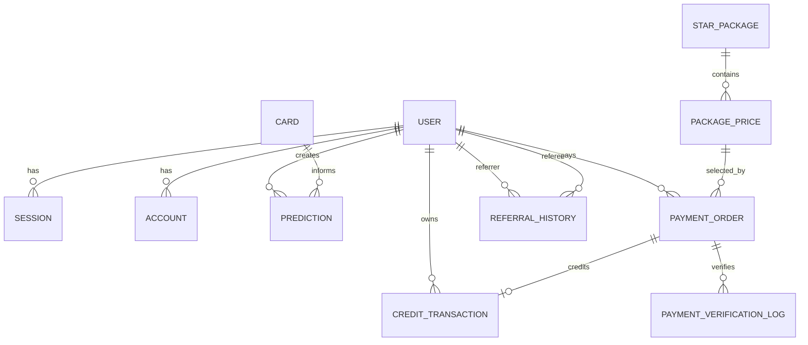

# Project Map: MMV Tarots

**Last Updated**: 2026-03-20
**Branch**: `staging`
**Production URL**: `https://maemormimi.com`

## Philosophy
MMV Tarots คือแพลตฟอร์ม AI Tarot ที่ออกแบบให้ประสบการณ์ใช้งานลื่น, ตรงอารมณ์, และปลอดภัยกับบัญชีผู้ใช้ โดยมีแกนสำคัญ 4 เรื่อง:

- ใช้ Better Auth เป็น auth-core เดียว และแยก provider-specific concerns ของ LINE/LIFF ออกจาก navigation และ business flow
- ใช้ระบบ `stars` เป็นเครดิตกลางสำหรับ prediction, onboarding reward, referral reward, และ top-up
- มอง payment เป็น lifecycle ที่ต้องสื่อความหมายกับผู้ใช้ตรงความจริง ไม่ใช่เพียงเก็บ row ในฐานข้อมูล
- แยก owner ของ concern ชัด: auth, payment, referral, prediction, และ UI state ไม่ควรผสมกันจน debugging ยาก

หลังรอบล่าสุด ระบบ payment ถูกปรับไปสู่แนวคิด `single draft reuse` เพื่อให้ 1 purchase journey มี draft payment order หลักเพียง 1 แถวที่ revive ได้ แทนการสร้าง waiting draft ซ้ำแล้วทำให้ผู้ใช้สงสัยว่าจ่าย 1 ครั้งแต่มีหลายรายการ

## Key Landmarks

### App Routes (`app/`)
- `page.tsx`: หน้า landing และจุดเริ่มถามคำถาม
- `liff/page.tsx`: LINE LIFF gateway สำหรับ in-app login handoff
- `submitted/page.tsx`: หน้าแสดงสถานะงานทำนายหลัง submit
- `history/`, `history/[id]`: ประวัติคำทำนายและรายละเอียด
- `profile/page.tsx`: โปรไฟล์และข้อมูลผู้ใช้
- `package/page.tsx`: หน้าเลือกแพ็กเกจดาวและ resume payment journey ล่าสุด
- `billing/page.tsx`: หน้า billing history ที่โชว์เฉพาะรายการมีความหมายทางธุรกิจ
- `transactions/page.tsx`: หน้า ledger การเคลื่อนไหวของ stars
- `share/[id]/page.tsx`: หน้าแชร์ผลคำทำนาย
- `policy/privacy`, `policy/refund`, `policy/terms`: policy surfaces

### API Surfaces (`app/api/`)
- `auth/[...all]/route.ts`: Better Auth catch-all
- `auth/liff-verify/route.ts`: verify LINE token -> resolve identity -> issue session
- `predict/route.ts`: รับคำถาม, validate, สร้าง prediction job
- `predict/[jobId]/route.ts`: poll สถานะคำทำนาย
- `payment/orders/route.ts`: create/reuse/revive PromptPay order
- `payment/orders/[id]/status/route.ts`: current payment order status สำหรับ restore/polling
- `payment/orders/[id]/slip/route.ts`: upload slip และ trigger verification
- `payment/orders/me/route.ts`: billing history ของผู้ใช้ พร้อม visibility policy ลด noise draft
- `packages/route.ts`: star packages + pricing
- `credits/balance/route.ts`, `credits/history/route.ts`: stars balance + ledger data
- `support/route.ts`: ส่ง support ticket พร้อม billing context
- `user/referral-claim/route.ts`: claim referral code แบบ manual

### Server Core (`lib/server/`)
- `auth.ts`: Better Auth configuration + signup hooks
- `db.ts`: Prisma client entrypoint
- `services/line-identity-service.ts`: LINE identity verify/link/resolve
- `services/auth-session-service.ts`: session issuance wrapper
- `services/provider-identity-contract.ts`: provider-agnostic identity contract
- `services/referral-service.ts`: referral lifecycle orchestration
- `services/first-prediction-reward-service.ts`: idempotent first-prediction reward
- `services/payment-order-service.ts`: active reuse + revive draft policy
- `services/payment-fulfillment-service.ts`: slip verification -> credit fulfillment orchestration
- `services/slip-verification-service.ts`: SlipOK adapter, retry policy, error taxonomy mapping
- `payment-observability.ts`, `referral-observability.ts`: observability hooks
- `security/encryption.ts`: encrypted prompt storage support

### Client & UI (`components/`, `lib/client/`)
- `components/features/payment/PaymentModal.tsx`: create/resume order + revive feedback toast
- `components/features/payment/PromptPayQR.tsx`: QR display, countdown, slip submit, credited callbacks
- `components/features/billing-history-list.tsx`: billing list ที่ตัด user-facing `showAll` ออกแล้ว
- `components/features/transaction-history-list.tsx`: stars ledger UI
- `components/features/suggested-questions.tsx`: suggested prompts หน้าแรก
- `lib/client/providers/navigation-provider.tsx`: session shell + balance hydration + login handoff
- `lib/client/auth-client.ts`: Better Auth client
- `lib/shared/payment-error-semantics.ts`: shared semantics สำหรับ billing/support guidance
- `lib/shared/payment-success-presenter.ts`: toast/copy presenter หลัง credit เข้า

### Workflows & Services (`services/`)
- `services/tarot-service.ts`: async tarot workflow orchestration
- `services/prediction-service.ts`: prediction persistence and retrieval
- `services/credit-service.ts`: deduct/refund/update stars ledger

### Tests (`__tests__/`)
- `api/liff-verify-route.test.ts`: LIFF verify regression coverage
- `api/payment-orders-route.test.ts`: create/reuse/revive order path
- `api/payment-orders-me-route.test.ts`: billing history visibility contract
- `api/payment-order-slip-route.test.ts`: slip submit route behavior
- `services/payment-order-service.test.ts`: lifecycle guard/revive logic
- `services/payment-fulfillment-service.test.ts`: crediting + verification orchestration
- `services/slip-verification-service.test.ts`: SlipOK contract normalization and retry policy

## Recent Change Signals

### 2026-03-20: Payment Journey Realignment
- `13eb774`: phase 3-4-5 frontend journey & billing surface alignment
- `709d791`: implement draft-reuse lifecycle + revive API
- Result:
  - revive expired no-slip drafts instead of minting duplicate rows
  - show user feedback when a previous draft is revived
  - remove `showAll` from billing UI while preserving internal/debug API support
  - hard gate passed (`build`, `lint`, full test suite)

### 2026-03-19: Payment Success / Billing UX Refinement
- `4827035`: payment success UX refactor phases 3-4.5
- `38917be`: payment success UX refactor phases 0-2
- `1835f10`: production cleanup for payment flow debug helpers

### 2026-03-18: Payment Grounding vs SlipOK Guide
- Oracle snapshot identified contract drift risks around endpoint/header/payload/response shape and delayed-bank retry semantics
- Current code already reflects the corrected `api/line/apikey/<branchId>` pattern and `x-authorization` behavior through `slip-verification-service.ts`

### 2026-03-14: LIFF Loading Theme Token Unification
- LIFF loading surface moved away from hardcoded black/white styling into semantic theme tokens

## Architecture Overview

### Auth + LIFF Flow
```text
LINE / Browser
   |
   +--> /api/auth/[...all] (Better Auth core)
   |
   +--> /liff
         -> POST /api/auth/liff-verify
         -> verify LINE token
         -> resolve/link user identity
         -> issue Better Auth session cookie
         -> restore mmv_target and continue protected flow
```

### Prediction Flow
```text
User submits question
   -> POST /api/predict
   -> validate session / rate limit / credits
   -> create Prediction(jobId)
   -> async tarot workflow
      -> gatekeeper agent
      -> analyst agent
      -> mystic agent
   -> save selected cards + final reading
   -> first-prediction reward if eligible
   -> client polls submitted page for completion
```

### Payment Flow
```text
Package page / PaymentModal
   -> POST /api/payment/orders
      -> reuse active order OR revive latest no-slip draft OR create new order
   -> PromptPay QR displayed
   -> upload slip to /api/payment/orders/[id]/slip
   -> SlipOK verify + categorized error mapping
   -> fulfillment creates credit transaction and updates stars
   -> billing/support surfaces consume normalized semantics
```

## Data Flow

### Prediction Domain
1. User asks a question from `app/page.tsx`
2. API validates auth, cooldown, and star balance
3. Prediction row is created with `jobId`
4. Tarot workflow runs gatekeeper + analyst, then mystic
5. Final reading is persisted and shown in `submitted` / `history`

### Payment & Credit Domain
1. User selects a package in `app/package/page.tsx`
2. Modal calls `POST /api/payment/orders`
3. Service chooses one of three paths: `active reuse`, `revived draft`, `new order`
4. User uploads slip
5. Slip verification service calls SlipOK and maps result to business semantics
6. Fulfillment credits stars and records ledger transaction
7. Billing list shows only meaningful states; support ticket can include billing context

### Referral Domain
1. Middleware captures `?ref=` into `mmv_ref` cookie
2. Signup hook records referral relationship asynchronously
3. Manual referral code can be claimed after signup
4. First successful prediction triggers referral reward logic if eligibility state allows

## Ownership Rules
- `auth-core`: session policy, provider wiring, cookie contract
- `line-gateway`: LIFF entry + token handoff only
- `line-identity`: LINE verification and account resolution only
- `prediction-workflow`: AI orchestration and prediction persistence
- `payment-order-service`: order lifecycle semantics only
- `payment-fulfillment-service`: verification + credit fulfillment only
- `billing-surface`: user-facing rendering of meaningful payment states

## Database Schema

### Core Domains
- `user`: ศูนย์กลางบัญชีผู้ใช้ เก็บ profile, stars, referral code, onboarding state
- `session`, `account`, `verification`: Better Auth persistence
- `prediction`: คำถาม, analysis result, selected cards, final reading, failure info
- `card`: master tarot card catalog
- `credit_transaction`: stars ledger สำหรับ topup, prediction, refund, onboarding, referral
- `star_package`, `package_price`: package catalog และราคาโปร/ราคาปกติ
- `payment_order`, `payment_verification_log`: payment lifecycle และ audit trail ของ verification
- `referral_history`: referrer/referee relation พร้อม source และ eligibility state
- `agent_config`: encrypted prompts/config ของ AI agents
- `suggested_question`: suggested prompts บนหน้าแรก

### Relationship Snapshot
- `user (1) -> (many) session/account/prediction/credit_transaction/payment_order`
- `user (1) -> (many) referral_history` ทั้งบทบาท referrer และ referee
- `prediction (many) -> user (0..1)`
- `payment_order (1) -> (0..1) credit_transaction`
- `payment_order (1) -> (many) payment_verification_log`
- `star_package (1) -> (many) package_price`
- `package_price (1) -> (many) payment_order`
- `agent_config` และ `suggested_question` เป็น supporting configuration domains



## Challenges & Dragons

### Active Risks
- Manual smoke ยังจำเป็นทุกครั้งหลัง deploy candidate โดยเฉพาะ LIFF app, mobile browser, และ payment journey จริง
- Payment side effects ยังพึ่ง observability/logs มากกว่า automated reconciliation dashboard
- Slip verification ยังพึ่ง third-party API เดียวเป็นหลัก ถ้า provider ช้า ระบบจะค้างอยู่ที่ `VERIFYING` ได้
- Raw SQL หรือ ops query ที่ไม่ introspect physical schema อาจเจอ mismatch เพราะตารางจริงเป็น `snake_case`
- First-prediction reward และ referral state machine ต้องเฝ้าระวัง idempotency ให้ดีเมื่อมี concurrent success paths

### Current Constraints
- ไม่มี `.env.example` ที่เป็น canonical source ของ environment contract
- Billing API ยังเก็บ `showAll=true` ไว้สำหรับ internal/debug path จึงต้องระวังไม่ให้ affordance นี้กลับมาโผล่บน user surface
- Payment rollout ยังต้องอาศัย manual verification checklist มากกว่าระบบ E2E เต็มรูปแบบ

### Resolved / Mitigated Risks
- session sync gap หลัง LIFF redirect ลดลงด้วย session-shell contract
- loading deadlock จาก coupling ของ session/balance ถูกแยก concern แล้ว
- duplicate waiting drafts สำหรับ 1 purchase journey ถูกลดลงด้วย single draft reuse semantics

## Tech Stack
- Next.js 16 (App Router)
- React 19
- TypeScript
- Better Auth
- Prisma + PostgreSQL
- Google Gemini via Vercel AI SDK
- Tailwind CSS + Framer Motion
- Sentry
- Vitest
