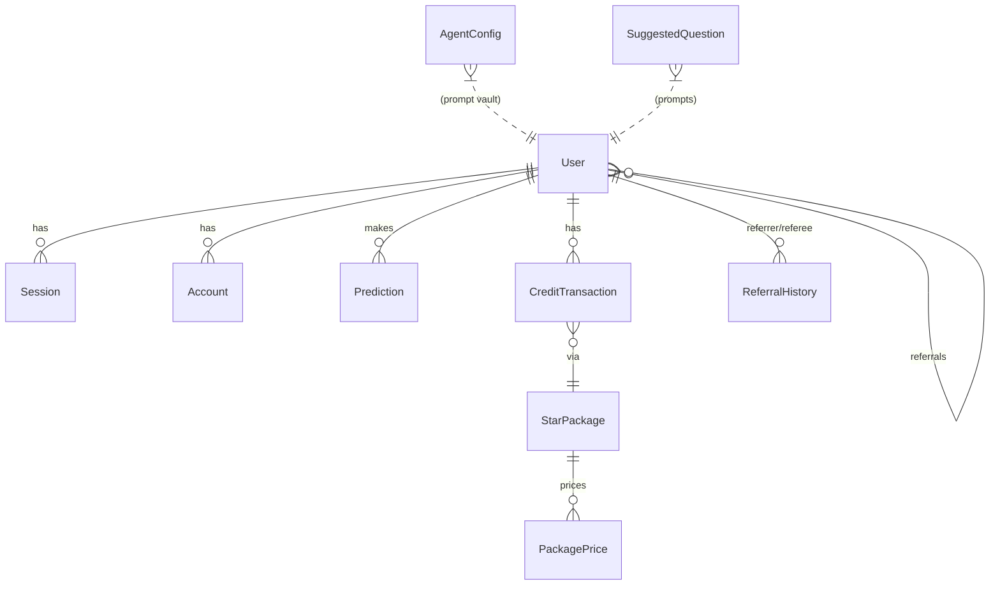

# 🗺️ Project Map: MMV Tarots

**Last Updated**: 2026-03-11 (Auth v3.1 post-execution)
**Branch**: `staging` (HEAD: `3301e26`) — ยังไม่ merge ไป `main`

## 🌟 Philosophy
**MMV Tarots** (Mimi Vibe Tarots) คือแพลตฟอร์มพยากรณ์ไพ่ยิปซีด้วย AI ที่เน้นประสบการณ์ผู้ใช้ที่นุ่มนวล ทันสมัย และมีความเป็นส่วนตัว (Mimi Vibe) โดยใช้เทคโนโลยี AI (Google/OpenAI) ในการตีความความหมายไพ่ให้เข้ากับบริบทคำถามของผู้ใช้แต่ละคน พร้อมระบบสะสมแต้ม (Stars) และการชำระเงินผ่าน Omise

**Production URL**: [https://maemormimi.com](https://maemormimi.com)

## 📍 Key Landmarks

### App Routes (`app/`)
-   `page.tsx`: หน้าแรก — กรอกคำถามและเลือกไพ่
-   `liff/`: **LIFF Gateway** — จุดเข้าจาก LINE Mini App (Auth v3.1)
-   `history/`: ระบบประวัติการดูดวง
-   `submitted/`: หน้าแสดงผลคำทำนาย + Animation
-   `profile/` & `package/`: ระบบ User Profile และซื้อ Stars
-   `share/`: Social share preview
-   `api/auth/liff-verify/`: **LIFF Auth Bridge** — Verify LINE token → Native Better-Auth session
-   `api/auth/[...all]/`: Better-Auth catch-all handler
-   `api/auth/referral-check/`: Referral attribution API

### Core Library (`lib/`)
-   **`lib/server/auth.ts`**: Better-Auth instance (Single Source of Truth สำหรับ session)
-   **`lib/server/services/`**: Business Logic (referral, user, suggested-questions)
-   **`lib/server/ai/`**: AI workflows (prediction generation)
-   **`lib/server/security/`**: Rate limiting, validators
-   **`lib/server/db.ts`**: Prisma client
-   **`lib/client/auth-client.ts`**: Better-Auth client SDK
-   **`lib/client/providers/navigation-provider.tsx`**: Durable redirect target recovery (`mmv_target`)
-   **`middleware.ts`**: Auth gate + referral attribution — ใช้ `getSessionCookie()` จาก `better-auth/cookies` (contract-based, ไม่ใช่ hardcoded name)

### Services (`lib/server/services/`)
-   `referral-service.ts`: Referral tracking และ reward
-   `user-service.ts`: User CRUD + onboarding
-   `suggested-question-service.ts`: Suggested prompts

### Tests (`__tests__/`)
-   `lib/liff-phase1.test.ts`: LIFF session issuance unit tests
-   `middleware.test.ts`: Middleware cookie contract verification
-   `api/liff-verify-route.test.ts`: Regression suite for `/api/auth/liff-verify`
-   `app/cards-import.test.ts`: CSV card import integration

### Components (`components/`)
-   `ui/`: Base Shadcn + Glassmorphism custom components
-   `features/`: Feature components (QuestionInput, Reading animation, etc.)

## 🔐 Auth Architecture (v3.1 — สถานะล่าสุด)

```
LINE App (LIFF)
    │
    ▼
app/liff/page.tsx
    │  1. เซ็ต mmv_target cookie (durable state)
    │  2. เรียก liff.getAccessToken()
    ▼
app/api/auth/liff-verify/route.ts
    │  3. Verify token กับ LINE API
    │  4. auth.$context.internalAdapter.createSession(userId)
    │  5. Better-Auth ออก signed cookie ให้ทั้งหมด (ห้าม manual set!)
    ▼
lib/client/providers/navigation-provider.tsx
    │  6. กู้คืน mmv_target จาก cookie (ป้องกัน URL param loss)
    ▼
หน้าปลายทาง (redirect target)
```

**Law**: Better-Auth คือ Single-Core Engine เท่านั้น — ห้าม `serializeSignedCookie` หรือ set session cookie เอง

## 🌊 Data Flow (Prediction)
1.  **Input**: User กรอกคำถามใน `QuestionInput` หน้า Landing
2.  **Selection**: ระบบเลือกไพ่จาก `Card` database ผ่าน `tarot-service`
3.  **Inference**: ส่งบริบทคำถาม + ไพ่ที่ได้ไปหา AI (GPT/Gemini) ผ่าน `prediction-service`
4.  **Storage**: บันทึกคำทำนายลง `Prediction` table และหัก Stars
5.  **View**: แสดงผลลัพธ์ในหน้า `submitted/` พร้อม Animation

## 🗃️ Database Schema



| Model | หน้าที่ | Key Fields |
|-------|---------|------------|
| `User` | ผู้ใช้หลัก | `stars`, `referralCode`, `onboardingCompleted` |
| `Session` | Better-Auth session | `token`, `expiresAt` |
| `Account` | OAuth accounts | `providerId`, `accountId` (LINE userId) |
| `Prediction` | ประวัติดูดวง | `question`, `result`, `cardIds` |
| `CreditTransaction` | Stars ledger | `type`, `status`, `omiseChargeId` |
| `StarPackage` + `PackagePrice` | ราคา package Stars | `amount`, `currency`, `isPromo` |
| `ReferralHistory` | Referral tracking | `status` (PENDING/GRANTED/BLOCKED) |
| `AgentConfig` | Encrypted AI prompts | `slug`, `encryptedPrompt` |
| `SuggestedQuestion` | Suggested prompts | `text`, `category` |

## 🐲 Challenges & Dragons

### 🔥 Active Dragons (ยังไม่แก้)
-   **Client Hydration Race** ⚠️: หลัง LIFF login redirect → home loading ค้าง เพราะ global overlay ขึ้นกับ `useSession()` + balance fetch พร้อมกัน — **ยังไม่มี blueprint แก้**
-   **Client E2E Coverage Gap**: Tests ครอบ API contract แต่ไม่ครอบ UI boot sequence timing หลัง redirect

### 🐢 Known Debt
-   **Search Oracle Index Stale**: `search-oracle.ts` ไม่ return mmv-tarots records — index ขาด
-   **AI Interpretations**: Prompt design ให้คงธีม Mimi Vibe คงต้องดูแลต่อเนื่อง
-   **Payment Integrity**: Stars deduction ต้องเป็น Atomic ทุกครั้ง

### ✅ Dragons Slain (v3.1)
-   ~~Cookie mismatch จาก `serializeSignedCookie`~~: ลบออกแล้ว, ใช้ Better-Auth native
-   ~~`mmv_next` URL param loss ใน LIFF redirect~~: แก้ด้วย durable `mmv_target` cookie
-   ~~Hardcoded cookie names ใน middleware~~: เปลี่ยนเป็น `getSessionCookie()` contract helper
-   ~~Domain mismatch (`www.` prefix) กับ LINE LIFF~~: แก้ด้วย domain normalization

## 🛠️ Tech Stack
-   **Framework**: Next.js 16 (App Router)
-   **Database**: PostgreSQL via Prisma (Neon DB)
-   **AI**: Vercel AI SDK (OpenAI & Google Gemini) + Encrypted AgentConfig
-   **Styling**: Tailwind CSS + Framer Motion (MimiVibe Glassmorphism)
-   **Auth**: Better-Auth v1.4.7 (Single-Core — LIFF + OAuth)
-   **Payment**: Omise (Charge + PromptPay)
-   **Monitoring**: Sentry
-   **Testing**: Vitest + Playwright
