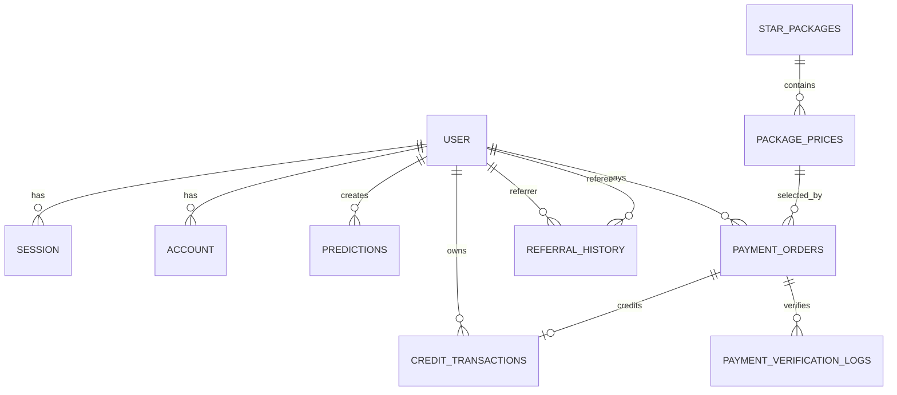

# 🗺️ Project Map: MMV Tarots

**Last Updated**: 2026-03-17 (Referral manual-balance closeout + schema sync)
**Branch**: `staging`

## 🌟 Philosophy
MMV Tarots คือแพลตฟอร์ม AI Tarot ที่เน้นความลื่นไหลของ UX และความปลอดภัยของบัญชีผู้ใช้ โดยให้
**Better-Auth เป็น auth-core เดียว** และแยก provider-specific concerns (LINE/LIFF) ออกจาก navigation shell และ business flow

ในรอบล่าสุดระบบ referral ถูกทำให้ deterministic มากขึ้นโดยเน้น source-aware policy (`LINK` vs `MANUAL_CODE`) และใช้ evidence gate ก่อน rollout

**Production URL**: [https://maemormimi.com](https://maemormimi.com)

## 📍 Key Landmarks

### App Routes (`app/`)
- `page.tsx`: หน้าแรก
- `liff/page.tsx`: LIFF gateway สำหรับ LINE in-app entry
- `profile/`, `package/`, `history/`, `submitted/`: protected user flows
- `api/auth/[...all]/route.ts`: Better-Auth catch-all endpoint
- `api/auth/liff-verify/route.ts`: LIFF verify orchestration (`verify -> resolve identity -> issue session`)
- `api/auth/referral-check/route.ts`: referral reward check

### Core Library (`lib/`)
- `lib/server/auth.ts`: Better-Auth core config และ hooks
- `lib/server/services/line-identity-service.ts`: LINE identity verification + account resolve/link
- `lib/server/services/auth-session-service.ts`: session issuance wrapper
- `lib/server/services/provider-identity-contract.ts`: provider-agnostic identity contract
- `lib/server/services/referral-service.ts`: orchestration ของ referral lifecycle (`signup -> first prediction -> claim/deny`)
- `lib/client/providers/navigation-provider.tsx`: session shell + balance hydration
- `lib/client/auth/session-shell-contract.ts`: gateway target contract (`mmv_target`)
- `middleware.ts`: auth gate + referral cookie attribution

### Tests (`__tests__/`)
- `api/liff-verify-route.test.ts`: liff verify route regression
- `services/line-identity-service.test.ts`: LINE identity service behavior
- `services/provider-identity-contract.test.ts`: provider identity contract behavior
- `middleware.test.ts`: auth gate + cookie contract verification
- `e2e/referral-reward-matrix-phase4.test.ts`: matrix contract ของ referral reward ตาม source/eligibility
- `e2e/referral-ledger-assertions.ts`: helper สำหรับตรวจ event ledger และกัน false positive

## 📡 Recent Change Signals (2026-03)
- `f245a65`: docs phase1 policy realignment ของ `#mmv-referral-manual-balance-fix`
- `1407ab5`: phase2 source-aware first-prediction orchestration
- `a15083a`: phase3 test alignment ให้เส้นทาง `MANUAL_CODE` ปิด end-state เป็น 2 stars ตาม policy
- Hard-gate phase4 ผ่านใน session closeout (build/lint/tests + sentinel checks)

## 🔐 Auth Architecture (v3.2)

```text
Browser / LINE LIFF entry
      |
      +--> /api/auth/[...all] (auth-core standard flow)
      |
      +--> /liff -> /api/auth/liff-verify (LINE-specific adapter)
                    1) verify LINE token
                    2) resolve/link app identity
                    3) issue Better-Auth session cookie
      |
Navigation session-shell hydrates session + balance independently
```

### Ownership Rules
- `auth-core`: session policy, provider wiring, cookie contract
- `line-gateway`: LIFF entry and token forwarding only
- `line-identity`: LINE account mapping concern only
- `identity-contract`: shared provider identity shape for future providers
- `session-shell`: UX hydration concern only (must stay provider-agnostic)

## 🌊 Data Flow (Prediction)
1. User submits question
2. Card selection and interpretation via AI agents
3. Save prediction + stars transaction
4. Render submitted result and persist history

## 🗄️ Database Schema

### Core Domains
- `user`: ศูนย์กลางบัญชีผู้ใช้ เก็บ referral code, stars, onboarding state และ relation ไปยัง session/account/prediction/transactions
- `referral_history`: เก็บความสัมพันธ์ referrer-referee, source (`LINK`/`MANUAL_CODE`), eligibility state และ reward amount
- `credit_transactions`: ledger ของ stars movement (`TOPUP`/`PREDICTION`/`REFERRAL`/`REFUND`/`ONBOARDING`)
- `predictions`: งานทำนายและผลลัพธ์ที่ผูกกับผู้ใช้
- `payment_orders`, `payment_verification_logs`, `star_packages`, `package_prices`: payment + pricing subsystem

### Relationship Snapshot
- `user (1) -> (many) session/account/predictions/credit_transactions/payment_orders`
- `user (1) -> (many) referral_history` ทั้งฝั่ง `referrer` และ `referee`
- `payment_orders (1) -> (0..1) credit_transactions` (ผ่าน `paymentOrderId` แบบ unique)
- `star_packages (1) -> (many) package_prices`, และ `package_prices (1) -> (many) payment_orders`



## 🐲 Challenges & Dragons

### Active Risks
- Manual smoke coverage ยังต้องทำซ้ำหลัง deploy candidate ทุกครั้ง (LIFF app + mobile browser + desktop browser)
- Payment and referral side effects ยังต้องเฝ้าดูผ่าน logs ใน production
- เอกสาร SQL/ops อาจไม่ตรง physical schema naming (`snake_case`) ทำให้ sentinel query fail ถ้าไม่ introspect ก่อน

### Resolved Auth Risks
- Session sync gap หลัง LIFF redirect ถูกลดด้วย hard navigation + session-shell contract
- Loading deadlock จาก coupling `useSession()` กับ balance fetch ถูกแยก concern แล้ว
- Better-Auth internals ถูกย้ายเข้า owner service boundaries (`line-identity`, `auth-session`)

## 🛠️ Tech Stack
- Next.js 16 (App Router)
- Better-Auth v1.4.x
- Prisma + PostgreSQL (Neon)
- Tailwind CSS + Framer Motion
- Sentry
- Vitest + Playwright
